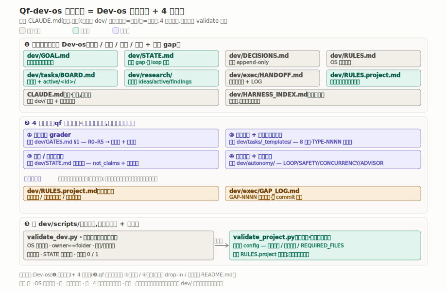
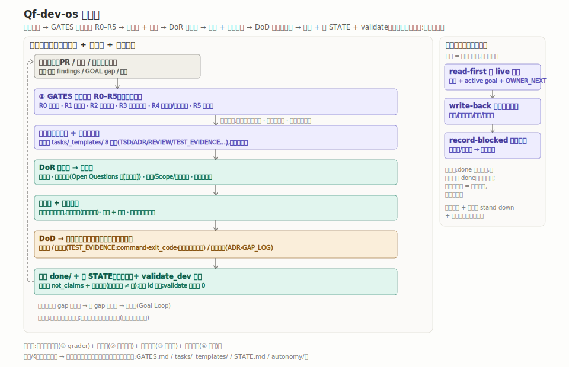

<!-- 格式·防跑偏 | 类型(结构型):本 README = OS 落地说明,**不进目标项目**(同 Dev-os)。
内容是「它解决什么 + 四台+4层结构 + 怎么 drop-in + memory seed + validator」;
项目状态/红线不写这里(那些进目标项目的 dev/)。【开发os级别】随骨架走。 -->

# Qf-dev-os

蒸馏出来的可复用开发操作系统：四台底座 + Goal Loop + 4 个严谨增量层，给「AI 驱动 / 长周期 / 无人值守 / 多并发 agent + 需严谨验收」的开发用。直接搬进任何 git 仓库。

一个会写代码的 agent，在长周期、常常无人值守的状态下推进一个项目，而且多个会话 / 并发 loop 同时在一个仓库上跑——这个处境逼出四个失效模式：**无法人工全审**（改动量大、夜里没人盯，每个 PR 人工签字物理上做不到）、**严谨度失配**（要么一刀切全上重流程拖垮 throughput，要么一刀切放行让高破坏面改动裸奔）、**过度声明**（把「声称」当「已验证」，把单场景小样本叫「已证明」，把上轮数据当本轮结果）、**文档与状态漂移**（状态活在会被压缩的对话里、双源各写一份、并发会话互相 clobber，跑两天就没人知道真实进度）。

总答案一句话：**让严谨成比例 + 可审计 + 诚实标界 + 有界自治。** 拿到改动先机械定级，低风险轻档放行、高风险才上全套工件；工程过程门可以不再强制人工签字，但交付物必须自带可审计清单；每条状态强制带「本条不证明什么 + 证据强度」，🟡声称 ≠ ✅验证；无人值守时每一轮是「读 live 状态 → 做一个有界增量 → 回写 / 卡住记账」，反划水、绝不「干到全 done」。关键洞察：**严谨按「破坏面 / 不可逆性」分轴，不按「能力」分轴**——agent 能不能自己起草实现可以放开，高破坏面 / 不可逆改动要不要额外把关，由项目自己在 `RULES.project.md` 定，OS 只给阶梯不替项目兜底。

机制细节见 `dev/` 各权威文件、方法与哲学见 `dev/README.md`、文件全图见 `dev/HARNESS_INDEX.md`。它是 **Dev-os 的严格超集**：只想要轻骨架 → 用纯 [Dev-os](https://github.com/dreaminate/Dev-os)；要严谨验收 + 风险门 + 无人值守 → 用本 OS（见末尾「相关仓库」）。

---

## 结构和流程





两张图 GitHub 上直接能看。下面用字符画把同样的内容摊开讲。

### 一、完整目录树

```
<project>/
├── CLAUDE.md                          ← 根路由:agent 开局先读它→被导向 dev/      [框架·勿改]
├── README.md                          ← 本文件:OS 安装说明,不进目标项目            [框架·勿改]
├── .gitignore
└── dev/                               ← 整套开发 OS（drop-in 这一层）
    │
    ├─❶ 四台核心
    │   ├── GOAL.md                  终态契约(已定决策/硬红线/分期/验收 oracle)     [项目填]
    │   ├── STATE.md                 现状 gap(每 loop 重生·含非声明/provenance 列)  [项目填·重生]
    │   ├── tasks/BOARD.md           活跃任务板(下一步以它实时为准)                 [项目填]
    │   ├── tasks/active/<id>/       在做的任务卡 + 工件                            [项目填]
    │   ├── tasks/done/<id>/         落档                                          [项目填]
    │   ├── research/                研究台(ideas→active→findings + archive)        [项目填]
    │   └── exec/{HANDOFF,LOG}.md    执行台:新 session 入口 + session 流水          [框架+项目占位]
    │
    ├─❷ 规约 / 红线
    │   ├── RULES.md                 OS 铁律宪法[权威]                            [框架·勿改]
    │   ├── RULES.project.md         本项目红线/冻结区/致命错误/风险触发类别          [项目填]
    │   ├── DECISIONS.md             已拍板决策账本(append-only)                    [项目填·追加]
    │   ├── ISSUES.md  experience.md 已知坑 / 通用经验                              [项目填·追加]
    │   └── CODEMAP.md               代码结构图(给 agent 导航)                      [项目填]
    │
    ├─❸ 增量层① 风险门禁 grader
    │   └── GATES.md                 THE GRADER[权威]:R0–R5 + 工件 + 测试 + 升级地板  [框架+触发占位]
    │
    ├─❹ 增量层② 工件证据库 tasks/_templates/（8 模板·全 [框架·勿改]）
    │   ├── TASK.md        ADR.md         TSD.md / LIGHT_TSD.md
    │   ├── REVIEW_RECEIPT.md(反自批)     TEST_EVIDENCE.md(反过度声明)
    │   └── INCIDENT_REPORT.md            PR_CHECKLIST.md
    │
    ├─❺ 增量层④ 自治 + 多智能体 autonomy/
    │   ├── LOOP_CONTRACT.md         循环契约[权威]:read→write-back→record-blocked  [框架·勿改]
    │   ├── SAFETY_ENVELOPE.md       无人值守安全外壳(七层防御纵深)[权威]            [框架·勿改]
    │   ├── CONCURRENCY.md           并发纪律(stand-down/分区/scoped-add)[权威]      [框架·勿改]
    │   ├── ADVISOR_PROTOCOL.md      单写者多模型顾问协议(model-agnostic)[权威]      [框架·勿改]
    │   ├── OWNER_NEXT.md            owner 明文转向收件箱(压过自设目标)             [项目填]
    │   ├── DECISION_RADAR.md        两阶段拍板:survey→ruling                       [项目填]
    │   └── runner/README.md         runner 由项目提供(契约在上,脚本在项目)         [项目填]
    │
    ├─❻ 增量层④ spec 静默决策账本
    │   └── exec/GAP_LOG.md          GAP-NNNN(同 commit 追加)                       [项目填·追加]
    │
    ├─❼ 索引 + 脚本 scripts/（全 [框架·勿改],除 validate_project）
    │   ├── HARNESS_INDEX.md         主索引[权威]:全文件地图(只导航,冲突以原文为准)
    │   ├── validate_dev.py          OS 结构自检(唯一阻断闸·连带跑 project)         [框架·勿改]
    │   ├── validate_project.py      项目侧检查(默认空跑绿)                         [项目填 config]
    │   ├── build_ledger.py          现生成全含量任务表
    │   ├── build_card_counters.py   从 OQ 标签派生计数器写回
    │   └── build_log_index.py       活跃+归档 LOG 统一索引
    │
    └─❽ README.md / dev/README.md     OS 规约方法与哲学(随骨架走)                   [框架·勿改]
```

### 二、四台底座 + 4 增量层（落点文件）

```
┌─ 底座(继承自 Dev-os)──────────────────────────────────────────────┐
│ 目标台 GOAL.md  ·  任务台 BOARD+active/  ·  研究台 research/  ·  执行台 exec/ │
│ + Goal Loop(诚实查 gap→变任务→执行+对抗测试→落档→重跑 gap→再循环)            │
│ + 诚实 gap(STATE 每 loop 重生,🟡未验证 ≠ ✅)                                │
└────────────────────────────────────────────────────────────────────┘
        ▲ 4 个增量层嵌进底座的台(不是另起炉灶):
        │
 ① 风险阶梯 grader ──────────► dev/GATES.md §1        长在任务台 intake
      拿到改动机械定 R0–R5 → 必备工件集 + 必跑测试,不拍脑袋
 ② 工件证据 + 可审计取代评审 ► dev/tasks/_templates/(8)    填进任务台
      工程门可降为「可审计交付」(不再强制人工签字),交付物自带可审计清单;
      TSD/ADR/REVIEW(反自批)/TEST(反过度声明)… + TYPE-NNNN 互引图
 ③ 诚实 / 非声明纪律 ────────► dev/STATE.md 非声明列     进 STATE 每行
      每条带 not_claims + provenance + 证据强度;小样本不说「证明/可信」
 ④ 自治循环 + 多智能体 ──────► dev/autonomy/            执行台运行契约层
      read→write-back→record-blocked / 反划水 / 安全外壳 / 并发 / 顾问

单一源铁律:每个机制只有一个权威家(上面「落点」),别处只用一句指针按章节名引、不复述。
主索引 dev/HARNESS_INDEX.md 只定位,冲突以原文为准。
```

### 三、风险阶梯 grader 怎么定门禁

```
每个改动(PR / 任务 / 一回合实现)进实现前走三步,权威在 dev/GATES.md §1:

  ① 定级 ──► 对照阶梯落到 R0–R5,先过升级地板(§2)再落级
  ② 取工件+测试 ──► 照该级「必备工件集 + 必跑测试类」备齐,高风险用仓库模板
  ③ 打标+自述 ──► header 标 risk_level=R?,交付出可审计清单(§6)

     级    一句话语义               必备工件(随级累加)            必跑测试
   ┌────┬──────────────────┬───────────────────────┬──────────────────┐
   │ R0 │ 无行为变化纯文本    │ PR 标 risk_level=R0       │ 无                │
   │ R1 │ 低风险展示层        │ LIGHT_TSD(自证全-no)      │ 截图 或 不测理由    │
   │ R2 │ 普通业务对象/接口    │ 接口/数据契约同步           │ 单测 或 契约测试    │
   │ R3 │ 碰核心契约面        │ TSD + 状态机/权限说明       │ 对抗+变形+幂等      │
   │ R4 │ 不可逆/高破坏面      │ +ADR +回滚/补偿 +release   │ R3 + 回滚演练       │
   │ R5 │ 系统级 / 发布闸      │ +TestEvidence +冻结方案     │ R4 + 多视角评审建议 │
   └────┴──────────────────┴───────────────────────┴──────────────────┘

  升级地板(三条硬规则,任何定级先过):
    碰敏感面即抬级(不因「改得小」降级) · 不确定取高 · 未打标不可合
  「触发哪一级」(碰什么算高风险)是项目内容 → 全留 <...> 占位,填在 RULES.project.md
```

### 四、Goal Loop + 自治循环

```
日常 Goal Loop:
  取 BOARD todo(进实现须 review_status=1 且 待拍=0 两闸皆过)
     │
     ▼
  active/<id>/ 写实现 + 对抗测试(「种已知 bug 门必抓」)──► 测试跑绿·不破基线
     │
     ▼
  落档 done/ ─► 刷 STATE(诚实标 🟡≠✅·带 provenance) ─► validate_dev.py 自检

无人值守自治(权威在 dev/autonomy/LOOP_CONTRACT.md),每轮 = 一次冷启动:

  ① read-first ──► 先读 live 交接文件 + active goal + OWNER_NEXT + DECISION_RADAR
                   (owner 输入压过 agent 自设目标;不凭记忆——记忆是上一轮的)
        │
        ▼
  ② write-back ──► 做一个有界增量(带边界/阶段校验/停止条件/安全下一步四样)
                   收口回写 live 文件 + 一行 exec/LOG.md(不假装一轮干到全完成)
        │
        ▼
  ③ record-blocked ──► 闭不掉的(缺拍板/撞硬门/撞并发冲突)记进待 owner 决策 /
                       GAP_LOG / DECISION_RADAR,绕开选下一件能自治推进的,不空转、不硬闯

  反划水:每个 goal 都要溯到真需求 + 述价值;禁 make-work / 重做已完成 / 凑量。
          「done」是证据门不是自我感觉——引不出具体证据 = 当作未落地,绝不归档。
```

### 五、validate_dev 拦什么

退出码 0 通过、1 失败,可以挂 CI 或 pre-commit;会自动连带跑 `validate_project.py`(项目侧)。

```
四台   GOAL/STATE/RULES/RULES.project/DECISIONS/BOARD/HANDOFF/LOG 等必需文件 + 目录骨架在
增量   4 层落地物存在:GATES + HARNESS_INDEX + 8 模板 + autonomy/* + runner + GAP_LOG(缺即 FAIL)
落档   BOARD 标 ✅done ↔ done/<id>/TASK.md 存在 · active/<id>/ 须在 BOARD 有行(防孤儿)
诚实   STATE 的 ✅ 行须挂可指认证据(防假绿灯) · STATE 含「非声明/provenance」列(增量④哨兵)
门禁   GATES 含 风险阶梯/R0/升级地板 字眼(grader 脊没被掏空,缺只 WARN)
OQ     拍板标签只认 [需拍板]/[已决] · 计数器 (已决 D/总) 与标签一致 · todo 卡 [必填] 节齐
       done 卡不可有未拍板项(FAIL) · active 卡 review_status=0 → WARN(实现/落档前需用户过目)
不变量 RULES.md 核心哨兵(对抗测试/扩展不替换/致命错误/🟡…)在 · 空骨架占位行 <...> 一律跳过
连带   自动跑 validate_project(项目锚点存在 / 旧路径前缀 / 冻结区 / 账本三向一致 / 配置脚本 bash -n)
```

---

## 搬进你自己的项目

### 0. 前提
- 项目已经是 git 仓库,本机装了 Python 3(跑自检脚本要用)。

### 1. 把框架拷进项目
```bash
# clone 本仓库,把 dev/ 和 CLAUDE.md 拷进你的项目根
git clone https://github.com/dreaminate/Qf-dev-os.git /tmp/qfdos
cp -R /tmp/qfdos/dev   <你的项目>/dev
cp    /tmp/qfdos/CLAUDE.md   <你的项目>/CLAUDE.md
```
> `dev/` 整套放进项目根,`CLAUDE.md` 也放项目根,agent 一开始先读它。
> **连空目录占位 `.gitkeep` 一起带**——`tasks/active`、`tasks/done`、`research/archive` 等靠它存在,漏了 `validate_dev` 会 FAIL。
> **别复制本仓库根的 `README.md`**(它是 OS 安装说明,不是项目文件)。

### 2. 填项目级文件（模板都带 `<...>` 占位,旁边有「怎么填」注）
| 文件 | 填什么 |
|---|---|
| `dev/GOAL.md` | 项目终态契约(已定决策 / 硬红线 / 分期 roadmap / 验收 oracle) |
| `dev/RULES.project.md` | 本项目红线(冻结区 / 范围 / 致命错误 / 风险阶梯触发条件) |
| `dev/GATES.md` §1/§2 触发类别占位 | 接 `RULES.project` 的风险分类(哪些类别落哪个 R 级、碰什么即抬级) |
| `dev/exec/HANDOFF.md` | 新 session 入口(项目名 / 可复用模块 / 测试命令) |
| `dev/autonomy/{OWNER_NEXT,DECISION_RADAR}.md`、`runner/README.md`、`exec/GAP_LOG.md` | 无人值守才需要,占位即可 |

> 触发类别是 grader 的「内容」:GATES §1/§2 给阶梯机制(R0–R5 + 升级地板),你只把项目里「碰了就不许当低风险」的面逐类枚举进 `RULES.project.md`,钉到对应 R 级。

### 3. 改 validate_project.py 的项目侧 config
```bash
# 改 dev/scripts/validate_project.py 顶部 config:
#   PROJECT_ANCHORS(关键文件) / STALE_PREFIXES(旧路径) / FREEZE_GLOBS(冻结区)
#   REQUIRED_TOKENS / LEDGER_CONSISTENCY …  默认空 = 跑绿,按文件里「怎么填」逐项填
# 别动 validate_dev.py(【开发os级别】勿改)
```

### 4. 自检
```bash
python dev/scripts/validate_dev.py        # OS 结构自检(连带跑 validate_project)
python dev/scripts/build_ledger.py        # 看全含量任务表
```
> 空骨架就该跑绿——占位行 `<...>` 一律跳过。没填占位它也 PASS;开始填内容后,假绿灯 / 标签漂 / 孤儿卡 / done 卡留未拍板项等才会被抓。

### 5. 种 memory（推荐）
把下方「memory seed」存成 `~/.claude/projects/<你的项目路径 slug>/memory/MEMORY.md` —— 让 agent 从第一天就知道 memory 与 dev/ 的分工:**dev/ = 项目状态**(在仓库、可自检),**项目 memory = dev/ 装不下的那层**(操作者画像 / 工作偏好 / 外部凭据)。

```markdown
# <项目名> memory 索引（项目级 · 私有）

> **项目状态全在仓库 `dev/`**（新 session 读根 `CLAUDE.md` → dev/ 四台）。
> 本 memory 只装 dev/ 装不下的那层:操作者画像 / 工作偏好 / 外部参考凭据。
> 铁律:① 别复制 dev/ 项目状态(双源必漂),引用按**章节名**钉 ② 某条成熟成项目规则→升级进 dev/,不留第二份。

**操作者 / 怎么协作（user）**
- (按需:谁在操作、中/英、怎么和 agent 协作、谁动真钱)

**工作偏好（feedback）**
- (按需:commit 习惯、协作节奏、复核口味等)

**外部参考 / 凭据（reference）**
- (按需:token/key 的存在与额度——**不是密钥本身**、外部方法论 URL)
```

### 6. 第一个任务
入口提示词是 `dev/exec/HANDOFF.md`,整段复制给新 session。
- 第一个任务录进 `dev/tasks/BOARD.md`,按 Goal Loop 走。
- **有风险先过 `dev/GATES.md` 定门**:据 R0–R5 拿到风险级 + 必备工件 + 必跑测试,不打标不可合。
- 高风险工件用 `dev/tasks/_templates/` 仓库模板,别自造格式。
- 碰**不可逆 / 高破坏面**改动:由项目在 `RULES.project.md` 定要不要额外把关(回滚 / 显式确认 / 人审),OS 只给阶梯。

### 自检
没填占位时 `validate_dev.py` 就该 PASS(空骨架跑绿);把 GOAL / RULES.project / GATES 触发类别 / HANDOFF 填上、第一张卡录进 BOARD 后,它会盯住假绿灯、缺工件、孤儿卡、标签漂、done 卡留未拍板项。

---

## 相关仓库

这是一个三层同源家族,共享「四台 + Goal Loop + 诚实 gap」底座,按需求选一层:

- **[Dev-os](https://github.com/dreaminate/Dev-os)** — 底座与标尺。单写者轻骨架:强制读 + 可自检 + 防漂,四台 + Goal Loop + 诚实 gap。项目**不需严谨验收、不跑无人值守、单人单线**开发 → 用它,别背 4 层的重量。
- **Qf-dev-os（本仓库）** — **Dev-os 的严格超集**。在底座上叠 4 个增量层(风险门禁 / 工件证据 / 诚实纪律 / 自治多智能体)。项目**需严谨验收、跑无人值守 / 长 loop、多并发 agent、被过度声明坑过** → 用它。
- **[Multi-Dev-Os](https://github.com/dreaminate/Multi-Dev-Os)** — 团队并发版。**多人同时**开发一个项目:per-developer folder 化 + 花名册角色(leader/admin/developer)+ 脚本现生成全局视图,少冲突。几个人一起在一个仓库上跑 → 用它。

一句话选型:**单人轻量 → Dev-os;单写者但要严谨验收 + 无人值守自治 + 多并发 agent → Qf-dev-os;多人协作 → Multi-Dev-Os。**

---

> **更多?** 这里只教你装。方法与哲学(每层在挡哪个失效模式、单一源/防漂铁律)在 [`dev/README.md`](dev/README.md);全文件地图与导航铁律在 [`dev/HARNESS_INDEX.md`](dev/HARNESS_INDEX.md)。
